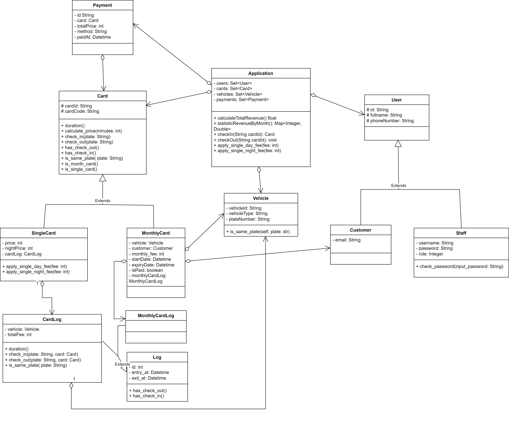

# Hệ thống bãi gửi xe thông minh

Đồ án giữa kì và cuối kì môn Lập Trình Python 2025-2026

## Thành viên nhóm 3

| No. | Name                | ID       |
|---|---------------------|----------|
| 1 | Nguyễn Võ Quốc Tuấn | 23130370 |
| 2 | Phan Bá Huy Hoàng   | 23130117 |
| 3 | Nguyễn Minh Trí     | 23130346 |
| 4 | Đỗ Thị Kim Chi      | 23130030 |

## Class diagram



## Tính năng

### **Quản lý thẻ**
- **Thẻ lẻ**: Thẻ gửi theo lượt, thanh toán theo lần sử dụng với giá ban ngày/đêm  
- **Thẻ tháng**: Gói đăng ký cho khách hàng thường xuyên  
- Xác thực thẻ và tính phí theo thời gian thực

### **AI Integration**
- Nhận dạng biển số tự động sử dụng mô hình YOLO  
- Xử lý luồng hình ảnh camera theo thời gian thực  
- Xác thực biển số thông minh hỗ trợ định dạng Việt Nam  
- Cấu hình thời gian dọn dẹp và tần suất làm mới của AI

## Technical Stack

- **Backend**: Python 3.13+  
- **Database**: SQL Server  
- **AI Models**: YOLO (Phát hiện và OCR biển số)  
- **GUI**: PyQt/Tkinter (tùy theo triển khai)  
- **IDE**: PyCharm

## Installation

### Prerequisites
Python 3.13+  
SQL Server  
GPU tương thích CUDA (khuyến nghị cho xử lý AI)

Setup  
1. Clone the repository  
```bash
git clone https://github.com/NguyenTuan2005/parking-management-system.git
cd parking-management-system
```
2. Install dependencies
```bash
pip install -r requirements.txt
```
3. Database Setup

- Chạy các script SQL để tạo bảng
- Nhập dữ liệu mẫu từ các file SQL được cung cấp: 
  - quy2.sql -> quy3.sql -> quy1.sql -> quy4.sql
